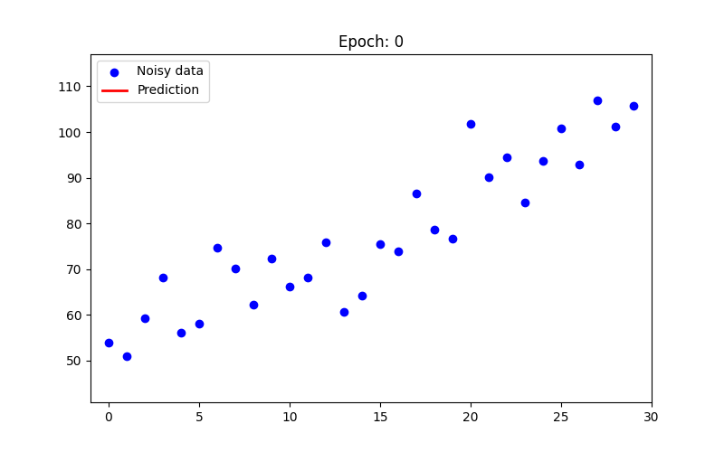

# Linear Regression with Gradient Descent

A collection of notebooks and scripts demonstrating the fundamentals of a Simple Single-Neuron Neural Network, focusing on Linear Regression and Gradient Descent from scratch.

No deep learning frameworks — just NumPy and a clean implementation of forward pass and gradient descent.

> Followed on by [MLP Digits Classifier](https://github.com/eniompw/MLP-Digits-Classifier), extending gradient descent from a single-output linear model to a multi-class neural network.

## 📚 Contents

* [Gradient Descent from Scratch](./linreg_gd.ipynb) - Jupyter Notebook exploring the implementation step-by-step.
* [Linear Regression Explanation](./linreg_notes.md) - Detailed explanation of the underlying gradient descent code and math.
* [Linear Regression Gradient Descent](./linreg_gd.py) - Basic Python implementation using raw inputs.

* [Gradient Descent Animation](./linreg_gd_anim.ipynb) - Animated visualisation of the regression line converging over training epochs.

* [Linear Regression Normalised](./linreg_gd_norm.py) - Implementation with normalized inputs for more stable and faster convergence.

## How It Works

1. **Data** — Generates 30 points following `y = 2x + 50` using `np.arange`.
2. **Initialisation** — Weight `W` and bias `b` start at 0; learning rate `learning_rate = 0.001`.
3. **Forward pass** — Computes predictions: `y_pred = W * X + b`.
4. **Gradients** — Calculates partial derivatives of Mean Squared Error (MSE) loss with respect to `W` and `b`.
5. **Update** — Subtracts `learning_rate * gradient` from each parameter, nudging them toward lower loss.
6. **Result** — After 10,000 epochs, the model recovers `w ≈ 2` and `b ≈ 50`.

See [linreg_notes.md](./linreg_notes.md) for a detailed breakdown of the math and code.

> **Note 1:** The `30` data points were found empirically to be enough for the model to reliably recover `w ≈ 2` and `b ≈ 50`.
>
> **Note 2:** Removing the learning rate (`learning_rate`) causes `dW` and `db` to explode, resulting in `y_pred` becoming `NaN` and training failing completely.
>
> **Note 3:** For the [Linear Regression Gradient Descent](./linreg_gd.py) example, themv Gradient_Descent.gif linreg_gd_anim.gifmv Gradient_Descent.gif linreg_gd_anim.gif learning rate (`0.001`) and number of epochs (`10,000`) were found empirically — small changes to either can cause the model to converge too slowly or diverge entirely.
>
> **Note 4:** The [Linear Regression Normalised](./linreg_gd_norm.py) example normalises the inputs for more stable convergence, reducing sensitivity to the choice of learning rate. This allows a much lower learning rate of `0.1` and only `20` epochs to converge.

## 🛠️ Key Libraries

* `matplotlib` - For histogram and scatter plot visualizations.

## 🔗 References

* [Boston Housing](https://github.com/eniompw/BostonHousing) - Practical real-life example applying linear regression with gradient descent on a well-known dataset.
* [Regression from Scratch Example](https://web.archive.org/web/20230403152706/https://aakashns.medium.com/linear-regression-with-pytorch-3dde91d60b50) (Medium)
* [Gradient Descent in Python](https://www.geeksforgeeks.org/how-to-implement-a-gradient-descent-in-python-to-find-a-local-minimum) (GeeksforGeeks)
* [Gradient Derivative Calculation](https://web.archive.org/web/20220419231100/https://towardsdatascience.com/gradient-descent-from-scratch-e8b75fa986cc?gi=2fc7792409a4) (Towards Data Science)

